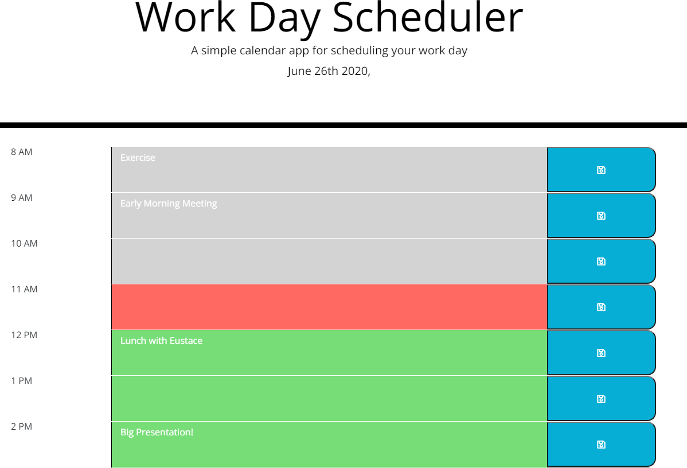
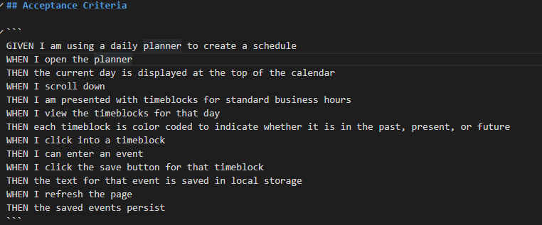

# Work Day Scheduler

The purpose of this assignment is to create a simple scheduling program. The different rows will turn different colors depending upon if the hour is in the past, present, or future.

## How to Use

Simply type in activities in the rows of your choosing. Click the blue save button on the side of the corresponding row to save in local storage. The typed activity should persist through a refresh. 

## Parameters

The following screenshot shows the parameters that I was given.

Enjoy!

[Work_Day_Scheduler](https://admjeffery.github.io/Work_Day_Scheduler/)